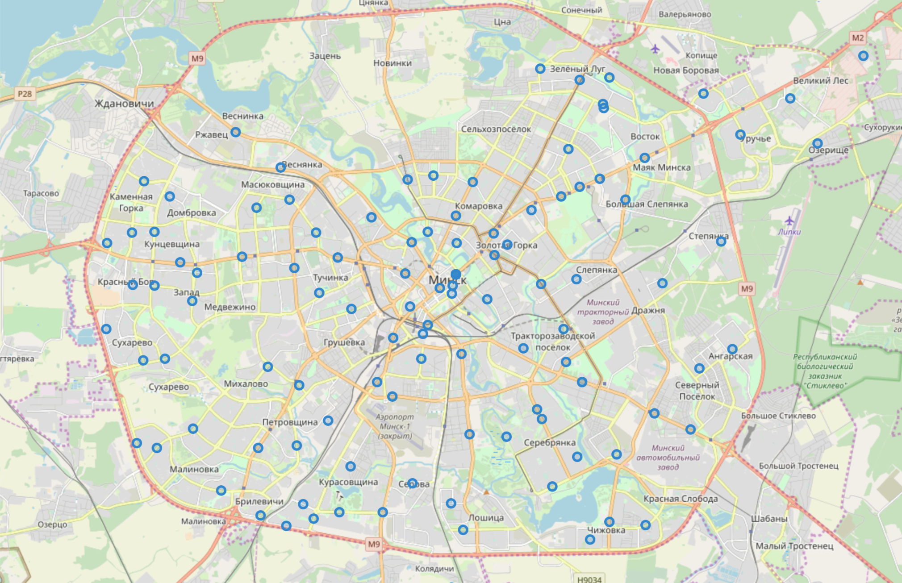
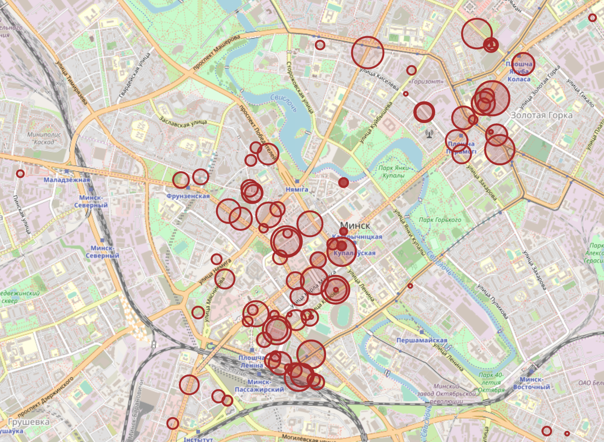
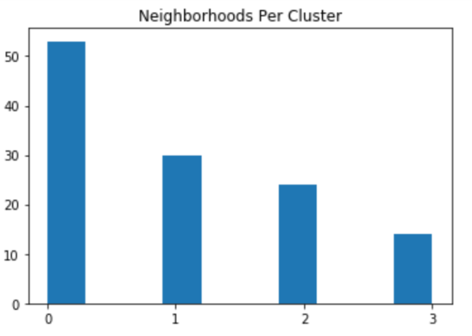
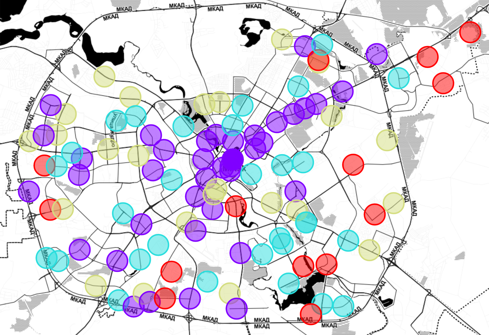

# Explore Locations For Coffee Shops in Minsk, Belarus

## Introduction

Coffee is the world’s most popular beverage, it’s a universal drink that appeals to the majority of the population, 
and inexpensive to prepare. Thanks to this popularity coffee shops are considered profitable businesses 
that are relatively easy to operate. However, while it may appear to be easy, opening a coffee shop business requires 
a lot of insight, research, and planning. 

Coffee shops are a great place to socialize: to meet friends, for informal meetings, or for students 
to catch up on schoolwork. Given the above having a great location is obviously very important for attracting customers. 
To be successful, you need the right location for your coffee shop. You probably want something centrally located, 
a place where people already gather. Moreover, while you may not have direct competitors, the substitutes 
also play an important role at filling the needs of your customers. Substitutes can include places like cafe or 
donut shops – or any fast food place that serves coffee.

Even, if you are franchising or buying an existing business the location is pre-selected but you should still do your 
research and decide whether the existing or selected location is a good one.

## Foursquare API

In this post I will show how Foursquare location data may be leveraged to analyze location and statistics 
for existing coffee shops and substitutes. I also going to try formulating some recommendations 
on choosing a right location for a new coffee shop in Minsk, Belarus. 

Foursquare is a technology company that built a massive dataset of location data. Currently its location data 
is the most comprehensive out there, and quite accurate that it powers location data for many popular services 
ike Apple Maps, Uber, Snapchat, Twitter and many others, and is currently being used by over 100,000 developers, 
and this number is only growing.

The Foursquare APIs will be used to extract the following information:
* Locations of the existing coffee shops
* Details for existing coffee shops like number of likes, ratings, and price tiers
* Locations and categories of substitute venues in *coffee* category

## Explore Existing Coffee Shops

Let's analysis with exploring existing coffee shops in the city: using Foursquare Explore API to get list of most 
popular venues with category ID **Coffee Shop - 4bf58dd8d48988d1e0931735**. I found that even while specifically 
setting the category ID, the API returned venues of related types as well. If we filter out all the related categories,
there is only 57 coffee shops in the results.

So, let's try a different approach and do search for coffee shops in city neighborhoods. There are nine districts 
in the city, but this division looks too coarse for our goals. At the same time, location of the post offices should be well 
correlated with the distribution of the population. I extracted this information from the official post service site: 
http://belpost.by/branch/post/otdeleniya-sviazi/

The page was scraped using BeautifulSoup library and data loaded into Pandas DataFrame. The neighborhoods address 
information is used to define geographical coordinates using the Geocoder Python package. 

        Postalcode	    Address	                            Latitude    Longitude
    0	220001	    ул. Московская,16, 220001,г. Минск	    53.887819	27.538548
    1	220002	    ул. Сторожевская,8, 220002,г. Минск	    53.914390	27.553282
    2	220003	    ул. Одинцова, 113, 220003,г. Минск	    53.901167	27.427478
    3	220004	    ул. М.Танка,36, к.2, 220004,г. Минск    53.903750	27.565430
    4	220005	    пр. Независимости,46, 220005,г. Минск   53.914125	27.581544

The next picture shows the neighborhood centers on the map using Folium.

We can see that our assumption is confirmed and post offices are distributed quite evenly in the residential areas. 
Now, let's look for venues in section *coffee* (that includes coffee shops and related categories) 
in each neighborhood within radius of 500 meters. After filtering by the venue category the resulting data frame contains 253 venues.

On the map we can clearly see that coffee shops tend to be located in the city business center, 
along the main transportation routes (main avenues and the metro lines), and in several clusters in residential areas.

I used Foursquare API to collect stats for the existing coffee shops including:
- *tipCount* (number of tips here)
- the *price* tier from 1 (least pricey) - 4 (most pricey)
- numerical *rating* of the venue (0 through 10; not all venues will have a rating)
- *likes* the count of users who have liked this venue

### Results
Most coffee shops in Minsk work in low price tier and only 8% work in price tier 2. Most of these more expensive 
coffee shops located in the city center.

I found that around 58% of venues have no rating assigned, it's quite surprising result for me. 
Most of the rated venues have rating between 6 and 8 points. If we look at the ratings on the city map, 
we can see that most of high-rated coffee shops are located 
in the city center and along the main transportation routes.

If look at the like counts, we can see that 75% of coffee shops has less than 20 likes. At the same time, 
there are several venues with high count of likes in our data set. 
Again, the popular coffee shops tend to be located in the city business center and along the main transportation routes 
(main avenues and the metro lines). The most popular coffee are clustered around two locations in the city center.

The **tips count** is highly correlated with number of likes the coffee shops have. We can see very similar histogram and 
distribution on the city map.

## Explore The Neighborhoods

As the first step I checked how many venues have been returned for each neighborhood given the radius of 500 meters 
and the venue limit of 100. We got the following results of _describe_ operation for our data frame:

    count    108.000000
    mean       8.000000
    std        9.086294
    min        1.000000
    25%        2.000000
    50%        4.000000
    75%       10.250000
    max       34.000000

We can see that _count_ is 108, which means that for 13 neighborhoods Foursquare does not return any coffee shop 
nor substitute venues. Maximal number of venues is 34 and median is only 4, just 25% of neighborhoods have more than 10
venues. In total there are 28 uniques categories in our data frame.

As the next step, we one-hot encoded the venue categories, grouped rows by neighborhood and took the mean of 
the frequency of occurrence of each category. Now, we can find out what the top 5 most common venues 
for the first 3 neighborhoods in our data frame are.

    ----ул. Московская,16, 220001,г. Минск----
             venue  freq
    0  Coffee Shop  0.36
    1         Café  0.27
    2   Steakhouse  0.09
    3       Buffet  0.09
    4  Pizza Place  0.09
   
    ----ул. Сторожевская,8, 220002,г. Минск----
             venue  freq
    0         Café  0.67
    1  Coffee Shop  0.33
    2       Bakery  0.00
    3   Donut Shop  0.00
    4   Steakhouse  0.00
    
    ----ул. Одинцова, 113, 220003,г. Минск----
                venue  freq
    0          Bakery   0.0
    1             Bar   0.0
    2      Steakhouse   0.0
    3   Shopping Mall   0.0
    4  Sandwich Place   0.0
    
It's interesting, that even first three neighborhoods look quite different: the first one shows approximately equal 
mix of Coffee Shop and Café venues, the second one has almost twice more Cafés than Coffee Shops, 
and there are no venues at all in the third one.

I clustered the neighborhood into 4 clusters using k-means algorithm; the frequencies of occurrence 
for each category in neighborhood used as features. And we got 4 reasonably sized clusters.

The next picture shows mean values for frequencies of venue categories in our clusters.

So, we can describe our clusters in the following way:
* Cluster 0 - mixes Cafe and Coffee Shop venues
* Cluster 1 - most of venues are Cafes
* Cluster 2 - most of venues are Cofee Shops
* Cluster 3 - almost missing venues in the categories we looked for

The next image shows how the clusters distributed on the city map.

## Recommendations
As result of the analysis we may formulate the following recommendations on choosing location for a coffee shop:
* We need to choose a location with high traffic. In Minsk it is the city business center, streets along the main 
transportation routes and the metro lines, and several clusters in residential areas.
* We need to choose a location within the city center for a coffee shop with pricing above tier 1.
* The most popular coffee are clustered around two locations in the city center. However, we must take into account 
the high level of competition in these highly attractive areas.
* Neighborhoods with mix of Cafe and Coffee Shop venues are located in the city center and along the metro lines. 
In these areas, competition is very high, moreover, coffee shops have to compete with cafes and other substitute venues.
* In residential areas coffee shops are less popular than cafes. It seems more risky to open a new coffee shop 
in these neighborhoods.
* Neighborhoods where Coffee Shops make up the majority of the venues are located near the transport and shopping hubs. 
It may make sense to position new coffee shop as a place to socialize: to meet friends, for informal meetings, 
or for students to catch up on schoolwork in these areas, since we cannot see pressure from cafes in this areas.
* There 13 neighborhoods with no coffee shop nor substitute venues at all; these areas do not look promising.

## Conclusion
We saw how Foursquare APIs _explore_ function is used to analyze location and statistics data for existing coffee shops 
and substitutes. We also explored, compared and grouped the neighborhoods into clusters using the k-means 
clustering algorithm.